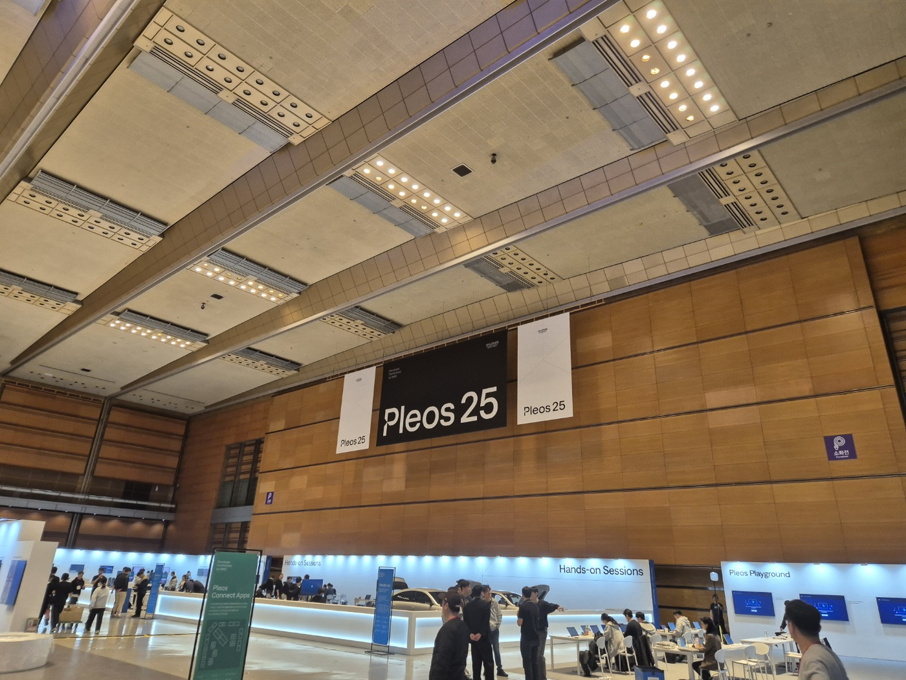
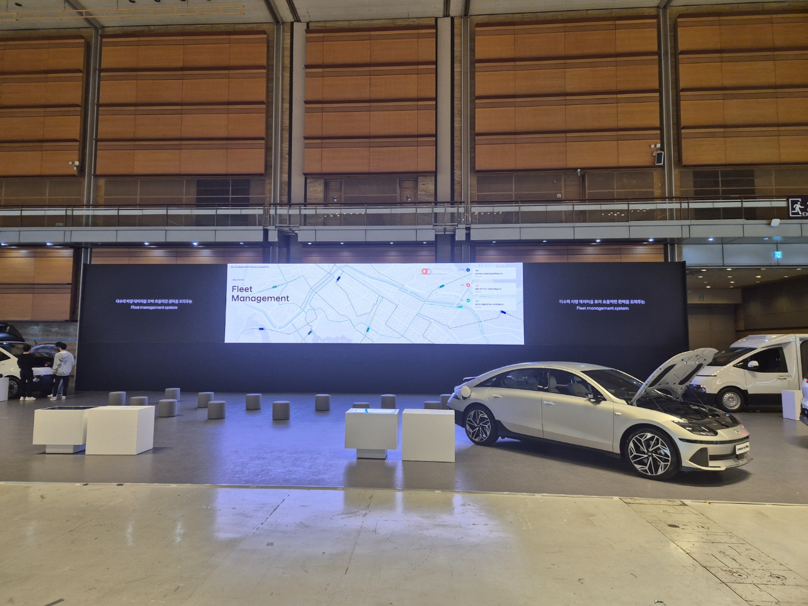
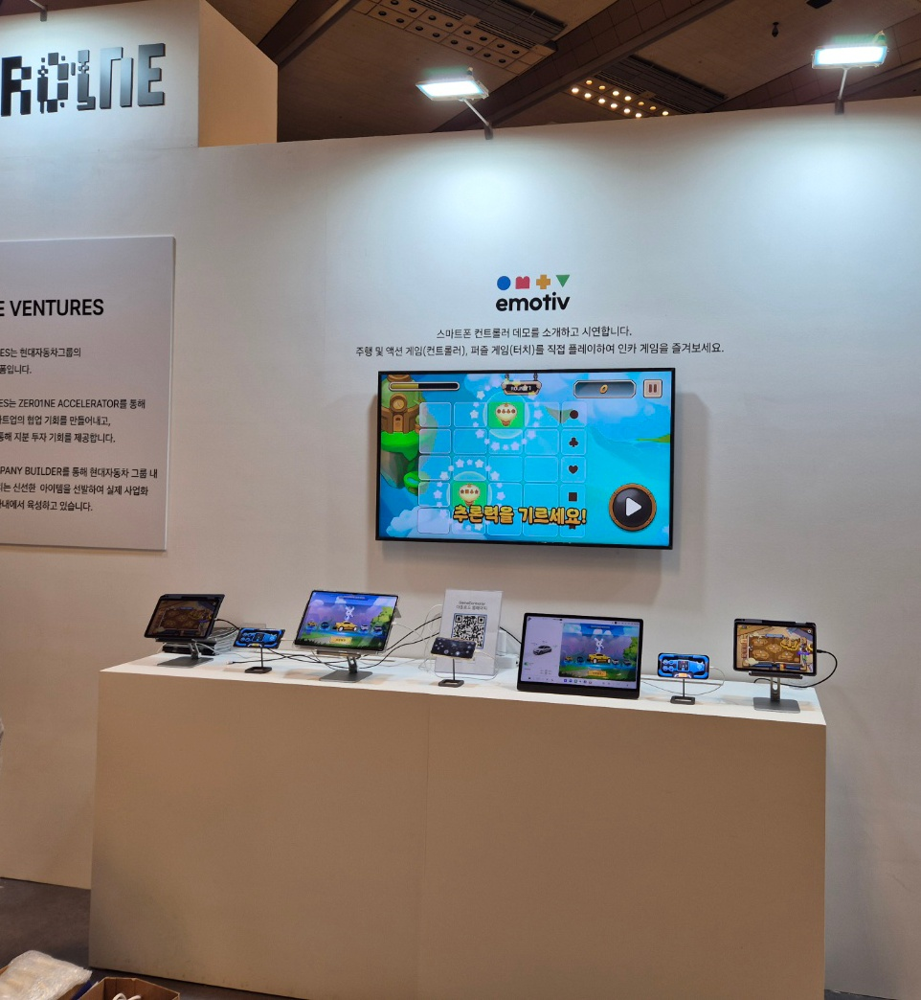
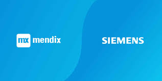

# 👋 Hi~~! I'm David Lee.

- [최근소식 (Recent News)](#최근소식-recent-news)
- [소개 (About Me)](#소개-about-me)
- [주요 플랫폼 개발 소개 (Platform Development Overview)](#주요-플랫폼-개발-소개-platform-development-overview)
- [Languages and Skills](#languages-and-skills)
- [Projects and Achievements](#projects-and-achievements)
- [Certifications](#certifications)
- [Others](#others)

### 최근소식 (Recent News)

@ VSCode + Copilot 활용 (Using VSCode Copilot)
- Copilot은 코드 작성 속도를 높이고, 반복 작업을 줄이며, 새로운 기술을 배우는 데 도움을 주었습니다.  
    Copilot helps increase coding speed, reduce repetitive tasks, and learn new technologies.
- 코드 자동 완성 및 제안 기능을 통해 생산성을 극대화할 수 있었습니다.  
    Maximize productivity with code auto-completion and suggestion features.  
- 다양한 프로그래밍 언어와 프레임워크를 지원이 되어 다양한 업무를 멀티로 개발이 가능합니다.  
    Supports various programming languages and frameworks, enabling multi-task development across diverse projects.

@ Cursor 활용 (Using Cursor)
- https://eopla.net/magazines/28938
- Cursor는 AI 기반 코드 편집기로, 개발자 생산성을 극대화하는 데 도움을 줍니다.  
    Cursor is an AI-powered code editor that helps maximize developer productivity.  
- 코드 작성, 디버깅, 리팩토링을 위한 강력한 도구와 기능을 제공합니다.  
    Provides powerful tools and features for coding, debugging, and refactoring.  
- AI 기반 코드 제안 및 오류 탐지 기능으로 코드 품질을 향상시킵니다.  
    Improves code quality with AI-driven code suggestions and error detection.  

@ Participation in Hyundai Motor Group Developer Conference (Pleos)  
- 현대자동차 개발자 컨퍼런스(Pleos) 참가  
    - [Hyundai Motor Group DevCon](https://devcon.hyundaimotorgroup.com/2025)
- 전시내용
    - BLE Game Controller (Unity)
        - Bluetooth Low Energy를 활용한 게임 컨트롤러 개발
        - 실시간 데이터 전송 및 낮은 전력 소모 최적화
    - AAOS Game 개발 및 연동 (Unity)
        - Android Automotive OS 기반 게임 개발
        - 차량 시스템과의 통합 및 최적화
    - Spring Boot (Kotlin) 통신
        - RESTful API 설계 및 구현
        - 실시간 데이터 처리 및 동기화

---

### 소개 (About Me)

I have been working as a developer for the past 19 years, specializing in full-stack development and system architecture.  
저는 지난 19년 동안 풀스택 개발 및 시스템 아키텍처 전문가로 일해왔습니다.  

One of the key strengths I bring to the table is my deep understanding of different programming languages and technologies.  
제가 가진 주요 강점 중 하나는 다양한 프로그래밍 언어와 기술에 대한 깊은 이해입니다.  

I have worked on projects using languages such as Java, C++, and Python, and have experience with frameworks such as React.js and Next.js
저는 Java, C++, Python과 같은 언어를 사용한 프로젝트를 진행했으며, React.js와 Next.js와 같은 프레임워크 경험도 보유하고 있습니다.  

This diverse skill set enables me to adapt quickly to new technologies and solve complex problems efficiently.  
이러한 다양한 기술 스택은 제가 새로운 기술에 빠르게 적응하고 복잡한 문제를 효율적으로 해결할 수 있게 합니다.  

In addition to my technical skills, I am a highly analytical and detail-oriented individual.  
기술적 역량 외에도, 저는 분석적이고 세부적인 부분에 주의를 기울이는 사람입니다.  

I have a strong ability to analyze requirements, design robust solutions, and write clean and maintainable code.  
요구사항을 분석하고, 견고한 솔루션을 설계하며, 깔끔하고 유지보수 가능한 코드를 작성하는 데 강한 능력을 가지고 있습니다.  

I take pride in my ability to deliver high-quality software that meets the needs of users and exceeds expectations.  
사용자의 요구를 충족하고 기대를 초과하는 고품질 소프트웨어를 제공하는 데 자부심을 느낍니다.  

Throughout my career, I have had the opportunity to work in various challenging projects, both individually and as part of a team.  
경력 동안, 저는 개인적으로 그리고 팀의 일원으로서 다양한 도전적인 프로젝트를 수행할 기회를 가졌습니다.  

This has sharpened my collaboration and communication skills, allowing me to effectively collaborate with cross-functional teams and stakeholders.  
이 경험은 저의 협업 및 커뮤니케이션 능력을 향상시켜, 다양한 기능 팀 및 이해관계자들과 효과적으로 협력할 수 있게 했습니다.  

I thrive in fast-paced environments and have a proven track record of meeting tight deadlines while maintaining the highest standards of quality.  
저는 빠르게 변화하는 환경에서 뛰어난 성과를 내며, 높은 품질 기준을 유지하면서도 촉박한 마감 기한을 준수한 입증된 경력을 가지고 있습니다.  

I am a lifelong learner and continuously stay updated with the latest industry trends and advancements.  
저는 평생 배움의 자세로 최신 업계 동향과 발전을 지속적으로 업데이트하고 있습니다.  

I believe in the importance of staying curious and exploring new technologies to stay at the forefront of the ever-evolving field of software development.  
저는 호기심을 유지하고 새로운 기술을 탐구하는 것이 끊임없이 변화하는 소프트웨어 개발 분야에서 앞서 나가는 데 중요하다고 믿습니다.  

---

### 주요 플랫폼 개발 소개 (Platform Development Overview)

- FEMS (Factory Energy Management System)  
    - 공장 에너지 관리 시스템으로, 에너지 소비를 모니터링하고 최적화하여 효율성을 극대화합니다.  
        A factory energy management system that monitors and optimizes energy consumption to maximize efficiency.  
    - 실시간 데이터 수집 및 분석을 통해 에너지 절약 방안을 제시합니다.  
        Provides energy-saving solutions through real-time data collection and analysis.  
    - 주요 기능: 에너지 사용량 시각화, 이상 탐지, 보고서 생성, 예측 분석.  
        Key features: Energy usage visualization, anomaly detection, report generation, predictive analysis.  
    - 역할: 시스템 설계 및 백엔드 개발, 데이터베이스 최적화, 클라우드 인프라 설정.  
        Role: System design and backend development, database optimization, cloud infrastructure setup.    
    - 기술 스택: Spring Boot, React.js, PostgreSQL, AWS, Docker, Kubernetes
    - 주요 성과: 에너지 소비 15% 감소, 실시간 모니터링 시스템 구축

- CMMS (Computerized Maintenance Management System)  
    - 설비 유지보수 관리 시스템으로, 설비의 유지보수 작업을 계획, 추적 및 관리합니다.  
        A computerized maintenance management system that plans, tracks, and manages maintenance tasks for equipment.  
    - 예방 정비 및 예측 정비를 통해 설비 가동률을 향상시키고, 다운타임을 최소화합니다.  
        Improves equipment uptime and minimizes downtime through preventive and predictive maintenance.  
    - 주요 기능: 작업 주문 관리, 자산 관리, 재고 관리, 보고서 생성.  
        Key features: Work order management, asset management, inventory management, report generation.  
    - 역할: 프론트엔드 및 백엔드 개발, API 설계, 데이터베이스 모델링.  
        Role: Frontend and backend development, API design, database modeling.  
    - 기술 스택: Node.js, Vue.js, MongoDB, Redis, Docker
    - 주요 성과: 유지보수 비용 20% 절감, 설비 가동률 30% 향상

- MES (Manufacturing Execution System)  
    - 제조 실행 시스템으로, 생산 공정을 실시간으로 관리하고 최적화합니다.  
        A manufacturing execution system that manages and optimizes production processes in real-time.  
    - 생산 계획, 작업 지시, 품질 관리, 재고 추적 등을 지원하여 생산 효율성을 향상시킵니다.  
        Supports production planning, work orders, quality control, and inventory tracking to improve production efficiency.  
    - 주요 기능: 생산 일정 관리, 실시간 데이터 수집, 품질 관리, 보고서 생성.  
        Key features: Production schedule management, real-time data collection, quality control, report generation.  
    - 역할: 프론트엔드 및 백엔드 개발, 데이터 통합, 시스템 성능 최적화.  
        Role: Frontend and backend development, data integration, system performance optimization.  
    - 기술 스택: Java EE, Angular, Oracle DB, Apache Kafka, Docker Swarm
    - 주요 성과: 생산 효율성 25% 향상, 품질 불량률 40% 감소

- WMS [유통, 공장] (Warehouse Management System)  
    - 창고 관리 시스템으로, 재고의 입고, 출고, 저장 및 추적을 효율적으로 관리합니다.  
        A warehouse management system that efficiently manages inventory receiving, shipping, storage, and tracking.  
    - 물류 프로세스를 최적화하여 운영 비용을 절감하고, 재고 정확도를 향상시킵니다.  
        Optimizes logistics processes to reduce operational costs and improve inventory accuracy.  
    - 주요 기능: 재고 추적, 작업 지시 관리, 창고 레이아웃 최적화, 보고서 생성.  
        Key features: Inventory tracking, work order management, warehouse layout optimization, report generation.  
    - 역할: 시스템 설계 및 개발, API 통합, 데이터베이스 최적화.  
        Role: System design and development, API integration, database optimization.  
    - 기술 스택: Python, Django, PostgreSQL, Redis, AWS Lambda
    - 주요 성과: 재고 정확도 99.9% 달성, 운영 비용 18% 절감

- 이커머스 플랫폼 (E-Commerce Platform)  
    - 온라인 쇼핑몰 및 전자상거래 플랫폼으로, 사용자 친화적인 인터페이스와 강력한 백엔드 기능을 제공합니다.  
        An online shopping mall and e-commerce platform that offers a user-friendly interface and robust backend features.  
    - 주문 처리, 결제 게이트웨이 통합, 제품 관리, 사용자 리뷰 및 추천 시스템을 지원합니다.  
        Supports order processing, payment gateway integration, product management, user reviews, and recommendation systems.  
    - 주요 기능: 제품 카탈로그 관리, 장바구니, 결제 처리, 주문 추적, 사용자 리뷰.  
        Key features: Product catalog management, shopping cart, payment processing, order tracking, user reviews.  
    - 역할: 프론트엔드 및 백엔드 개발, 결제 시스템 통합, 데이터베이스 설계 및 최적화.  
        Role: Frontend and backend development, payment system integration, database design and optimization.  
    - 기술 스택: Next.js, TypeScript, Node.js, MongoDB, AWS
    - 주요 성과: 전환율 35% 향상, 평균 주문 금액 25% 증가

---

### Projects and Achievements

#### Enterprise Solutions
- **Smart Factory Integration**
  - Led the integration of IoT devices with MES system
  - Implemented real-time data analytics dashboard
  - Achieved 40% reduction in production downtime

- **Cloud Migration Project**
  - Migrated legacy systems to AWS cloud infrastructure
  - Implemented containerization using Docker and Kubernetes
  - Reduced infrastructure costs by 30%

#### Mobile Applications
- **Healthcare Monitoring App**
  - Developed cross-platform mobile app using Flutter
  - Integrated with various health monitoring devices
  - Achieved 4.8/5 rating on app stores

- **Retail Management System**
  - Built mobile-first inventory management system
  - Implemented offline-first architecture
  - Reduced stock discrepancies by 45%

#### Web Applications
- **Real-time Collaboration Platform**
  - Developed using WebSocket and React
  - Implemented real-time document editing
  - Achieved 99.99% uptime

- **AI-powered Analytics Dashboard**
  - Integrated machine learning models for predictive analytics
  - Built using Python and TensorFlow
  - Improved decision-making accuracy by 60%

---

### Languages and Skills

| **Category** | **Skills** |  
| :---: | --- |  
| **Cloud**  |    |  
| **AI**  |     |  
| **DevOps** |   |  
|  WAS |       |  
| CI/CD |  |  
| DB  |      |  
| Linux OS  |   |  
| Proxy  |    |  
| Multi-Platform |    |  
| Native-App  |       |  
| Web |        |  
| Language |        |  
| IDE |    |  
| OS |   |  
| Build |     |  
| Terminal |  |  
| API Tool |  |  
| Doc |  |  
| GIT |   |  
| Other Tool |  |  

---

### Others

| **Brand** | **Skills** |  
| :---: | --- |  
| **Siemens** | PLC S7-1500 |  
| **Mendix** |  |